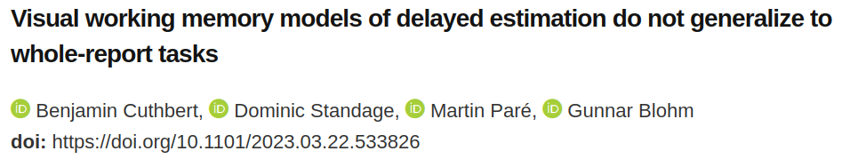

[](https://www.biorxiv.org/content/10.1101/2023.03.22.533826v2)

This repository contains all code associated with Cuthbert et al. 2023. The paper is currently in review, and is available as a preprint on [bioRxiv](https://www.biorxiv.org/content/10.1101/2023.03.22.533826v2).

Specifically, the code in this repo can:
- Download  and process [raw data](https://osf.io/kjpnk/) from [Adam, Vogel, and Awh (2017)](https://www.sciencedirect.com/science/article/abs/pii/S0010028517300634)
- Process raw data collected by us
- Reproduce model fits
- Reproduce all analyses and publication figures

## Repository overview
The repository is structured as follows:
```
data/       <-- raw & processed data
figures/    <-- exported and edited .png figures
models/     <-- trained models
notebooks/  <-- Jupyter notebooks to reproduce all figures
src/        <-- source code
src/data/   <-- data processing pipeline code
src/models/ <-- model code & command-line scripts for fitting to data
src/vis/    <-- plotting functions
makefile    <-- utility file w/ useful commands
```
The most logical starting point is the Jupyter notebooks in the `notebooks/` directory. There is one notebook corresponding to each publication figure. In general, these notebooks will import code modules from `src/`, load processed data from `data/`, and load model fits from `models/`. Documentation isn't perfect, but is mostly present in docstrings within `src/` modules if you want to dig deeper. 

## Data
This repository includes *processed* data in the form of pickled `pandas` DataFrames. These are the files imported by notebooks for analysis and plotting, and will be enough for most people to play with the results. If you want to reproduce the entire data processing pipeline, you have to download the *raw* .mat files from Adam et al.'s OSF repository first (see below for instructions). The raw data from our experiment is included in the repository under `data/01_raw/discrete/`.

## Installation (Mac/Linux)
([see here for windows instructions](#windows-installation))

1. Clone the repository:
    ```python
    git clone https://github.com/BlohmLab/whole-report-wm.git
    ```

2. I recommend creating a new virtual python environment. If using `venv`, this can be done as follows:
    ```bash
    # create environment
    python3 -m venv /path/to/new/environment

    # activate environment
    source /path/to/new/environment/bin/activate
    ```

    (other options like `conda` work just as well)

3. Install dependencies:
    ```bash
    # must be in top-level directory
    cd whole-report-wm/
    
    # view makefile options
    make

    # pip installs requirements.txt and local modules
    make init 
    ```

4. **Note:** *If you don't care about starting from raw data files, you can skip this step and use the processed data included in this repository.* Download data from the [Open Science Foundation](https://osf.io/) and run data-processing pipeline:
    ```bash
    # this can take a while, but won't re-download if it finds raw data
    make data
    
    ```
    That's it! Processed data can be found in `data/03_processed/`, and the paper's main results can be explored by running `jupyter notebook notebooks/`
   
## Windows Installation 

Windows does not come with `make` out of the box, so the utility functions listed above will not work. 
This can be dealt with by either [installing make](https://stackoverflow.com/questions/2532234/how-to-run-a-makefile-in-windows), or running the (slightly longer) commands below.

In my experience, most Windows users are running [Anaconda](https://www.anaconda.com/), so I've included `conda` commands for managing the virtual environment.

1. Clone the repository:
    ```python
    git clone https://github.com/BlohmLab/whole-report-wm.git
    ```
2. I recommend creating a new virtual python environment. If using `conda`, this can be done as follows:
    ```bash
    # must be in top-level directory
    cd whole-report-wm/

    # create environment
    conda create --name ENV_NAME --file requirements.txt

    # activate environment
    conda activate ENV_NAME
    ```
3. Install local modules:
    ```bash
    conda develop .
    ```

4. **Note:** *If you don't care about starting from raw data files, you can skip this step and use the processed data included in this repository.* Automated data downloading relies on `bash` and the `osfclient` CLI tool, which aren't available for Windows without some tinkering. Until I figure out a solution to this, you can manually download data from the OSF repos linked above and copy the contents to the corresponding folders in `data/01_raw`. Then run the processing pipeline:
    ```bash
    # extract data from .csv and .mat files
    python src/data/_01_extract_data.py

    # clean data
    python src/data/_02_clean_data.py

    # compile into nice pandas dataframes
    python src/data/_03_compile_data.py
    ```
    That's it! Processed data can be found in `data/03_processed/`, and the paper's main results can be explored by running `jupyter notebook notebooks/`